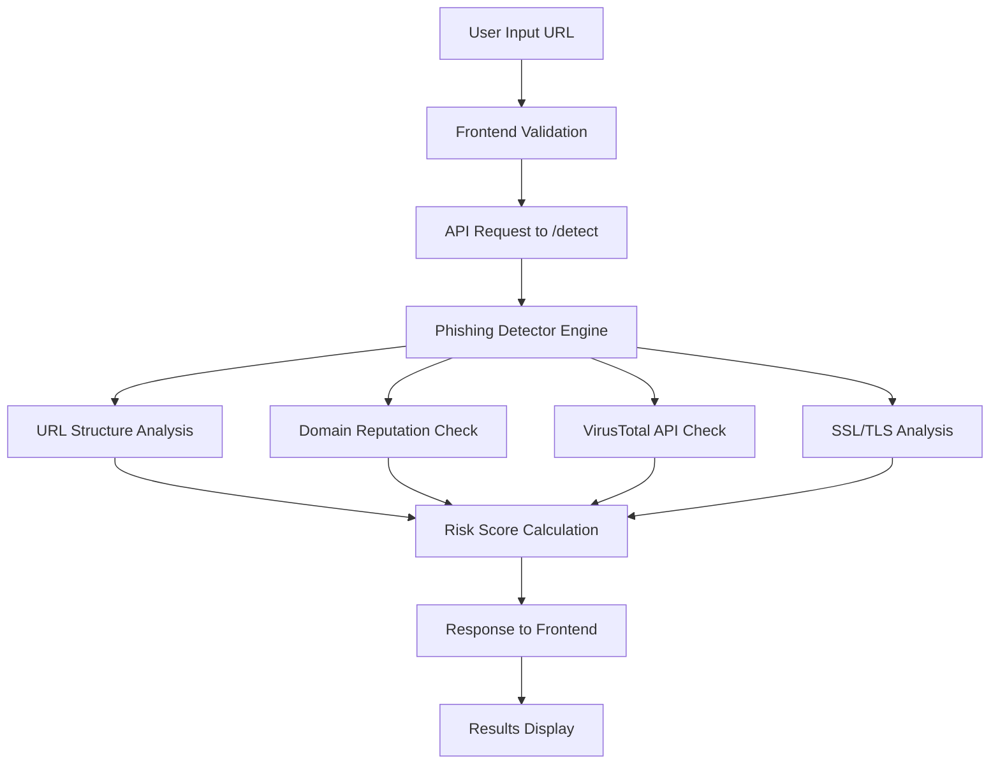

# 📁 Phishing Detection and Response System - Project Structure

## 🏗️ Overview

This document provides a comprehensive overview of the project's file structure, architecture, and organization. The system follows a **full-stack architecture** with a React frontend and Node.js backend, implementing modern development practices and clean code organization.

---

## 📊 High-Level Architecture

```
┌─────────────────────────────────────────────────────────────┐
│                    Phishing Detection System                │
├─────────────────────────────────────────────────────────────┤
│  Frontend (React + TypeScript)    │  Backend (Node.js + Express) │
│  ├── User Interface               │  ├── API Endpoints           │
│  ├── URL Analysis Form            │  ├── Phishing Detection      │
│  ├── Results Display              │  ├── VirusTotal Integration  │
│  └── Theme Management             │  ├── Domain Reputation       │
│                                   │  └── Data Storage            │
└─────────────────────────────────────────────────────────────┘
```

---

## 🌳 Complete Directory Structure

```
phishing-detection-system/
├── 📁 client/                          # React Frontend Application
│   ├── 📁 build/                       # Production build output
│   │   ├── 📄 asset-manifest.json      # Build asset manifest
│   │   ├── 📄 index.html               # Main HTML file
│   │   └── 📁 static/                  # Static assets
│   │       ├── 📁 css/                 # Compiled CSS files
│   │       │   ├── 📄 main.fa6f5dc5.css
│   │       │   └── 📄 main.fa6f5dc5.css.map
│   │       └── 📁 js/                  # Compiled JavaScript files
│   │           ├── 📄 main.2fc73347.js
│   │           ├── 📄 main.2fc73347.js.LICENSE.txt
│   │           └── 📄 main.2fc73347.js.map
│   │
│   ├── 📁 node_modules/                # Frontend dependencies
│   ├── 📁 public/                      # Static public assets
│   │   └── 📄 index.html               # HTML template
│   │
│   ├── 📁 src/                         # Source code
│   │   ├── 📄 App.tsx                  # Main application component
│   │   ├── 📄 index.tsx                # Application entry point
│   │   ├── 📄 index.css                # Global styles
│   │   ├── 📄 types.ts                 # TypeScript type definitions
│   │   │
│   │   ├── 📁 components/              # React components
│   │   │   ├── 📄 AnalysisResults.tsx  # Analysis results display
│   │   │   ├── 📄 Header.tsx           # Application header
│   │   │   ├── 📄 ThemeToggle.tsx      # Dark/light mode toggle
│   │   │   └── 📁 ui/                  # Reusable UI components
│   │   │       ├── 📄 Badge.tsx        # Status badge component
│   │   │       └── 📄 Card.tsx         # Card container component
│   │   │
│   │   ├── 📁 services/                # API and business logic services
│   │   │   ├── 📄 domainReputationService.ts  # Domain reputation API
│   │   │   └── 📄 phishingService.ts   # Main phishing detection service
│   │   │
│   │   ├── 📁 lib/                     # Utility libraries
│   │   │   └── 📄 utils.ts             # Common utility functions
│   │   │
│   │   └── 📁 contexts/                # React contexts (empty - for future use)
│   │
│   ├── 📄 package.json                 # Frontend dependencies and scripts
│   ├── 📄 package-lock.json           # Dependency lock file
│   ├── 📄 tsconfig.json               # TypeScript configuration
│   ├── 📄 tailwind.config.js          # Tailwind CSS configuration
│   ├── 📄 postcss.config.js           # PostCSS configuration
│   └── 📄 vercel.json                 # Vercel deployment configuration
│
├── 📁 src/                             # Backend Source Code
│   ├── 📄 phishingDetector.js         # Core phishing detection engine
│   │
│   ├── 📁 services/                    # Backend services
│   │   ├── 📄 domainReputationService.js  # Domain reputation analysis
│   │   └── 📄 virusTotalService.js    # VirusTotal API integration
│   │
│   └── 📁 config/                      # Configuration files
│       └── 📄 localStorage.js         # Local storage configuration
│
├── 📁 data/                            # Data storage
│   └── 📄 analyses.json               # Analysis results storage
│
├── 📁 node_modules/                    # Backend dependencies
│
├── 📄 server.js                        # Main server entry point
├── 📄 package.json                     # Backend dependencies and scripts
├── 📄 package-lock.json               # Backend dependency lock file
├── 📄 .env                            # Environment variables (local)
├── 📄 .gitignore                      # Git ignore rules
├── 📄 README.md                       # Project documentation
├── 📄 render.yaml                     # Render deployment configuration
├── 📄 vercel.json                     # Root Vercel configuration
├── 📄 test-virustotal.js              # VirusTotal API test script
└── 📄 PROJECT_STRUCTURE.md            # This file
```

---

## 🔧 Component Architecture

### Frontend Components

#### **Core Components**
- **`App.tsx`** - Main application component with URL analysis interface
- **`Header.tsx`** - Application header with branding and theme toggle
- **`AnalysisResults.tsx`** - Displays comprehensive analysis results
- **`ThemeToggle.tsx`** - Dark/light mode theme switcher

#### **UI Components**
- **`Badge.tsx`** - Status badges for risk levels and analysis results
- **`Card.tsx`** - Reusable card container component

#### **Services**
- **`phishingService.ts`** - Main service for URL analysis with fallback logic
- **`domainReputationService.ts`** - Domain reputation checking service

### Backend Services

#### **Core Engine**
- **`phishingDetector.js`** - Main phishing detection engine with multi-layer analysis

#### **External API Services**
- **`virusTotalService.js`** - VirusTotal API v3 integration for threat intelligence
- **`domainReputationService.js`** - Domain reputation and WHOIS analysis

#### **Configuration**
- **`localStorage.js`** - Local data storage and analytics management

---

## 🚀 API Architecture

### **REST API Endpoints**

```
📡 API Base URL: http://localhost:10000/api

┌─────────────────────────────────────────────────────────────┐
│                    API Endpoints                            │
├─────────────────────────────────────────────────────────────┤
│  GET    /health                    # Health check           │
│  POST   /detect                    # Main URL analysis      │
│  POST   /virus-total              # Direct VirusTotal check │
│  POST   /domain-reputation        # Domain reputation check │
│  GET    /analytics                # System analytics        │
└─────────────────────────────────────────────────────────────┘
```

### **Request/Response Flow**



---

## 🛠️ Technology Stack

### **Frontend Stack**
```typescript
React 18 + TypeScript          // Modern UI framework
Tailwind CSS                   // Utility-first CSS framework
Lucide React                   // Icon library
Axios                          // HTTP client
Vercel Analytics              // Performance monitoring
```

### **Backend Stack**
```javascript
Node.js + Express             // Server runtime and framework
Cheerio                       // HTML parsing and analysis
URL-Parse                     // URL structure analysis
Whois                         // Domain information lookup
Helmet                        // Security middleware
Rate Limiter                  // API rate limiting
```

### **External APIs**
```javascript
VirusTotal API v3             // Threat intelligence
Domain Reputation APIs        // Domain analysis
SSL/TLS Analysis             // Certificate validation
```

---

## 📦 Dependencies

### **Backend Dependencies**
```json
{
  "express": "^4.18.2",           // Web framework
  "cors": "^2.8.5",               // Cross-origin resource sharing
  "axios": "^1.6.0",              // HTTP client
  "cheerio": "^1.0.0-rc.12",     // HTML parsing
  "url-parse": "^1.5.10",         // URL parsing
  "whois": "^2.13.5",             // Domain lookup
  "helmet": "^7.1.0",             // Security headers
  "rate-limiter-flexible": "^4.0.1", // Rate limiting
  "dotenv": "^16.3.1"             // Environment variables
}
```

### **Frontend Dependencies**
```json
{
  "react": "^18.2.0",             // UI library
  "typescript": "^4.9.0",         // Type safety
  "tailwindcss": "^3.3.0",        // CSS framework
  "lucide-react": "^0.454.0",     // Icons
  "axios": "^1.6.0",              // HTTP client
  "@vercel/analytics": "^1.3.1"   // Analytics
}
```

---

## 🔐 Environment Configuration

### **Environment Variables**
```bash
# VirusTotal Configuration
VIRUSTOTAL_ENABLED=true
VIRUSTOTAL_API_KEY=your_api_key_here
VIRUSTOTAL_MAX_REQUESTS_PER_MINUTE=4

# Application Configuration
NODE_ENV=development
PORT=10000
FRONTEND_URL=http://localhost:3000
REACT_APP_API_URL=http://localhost:10000/api

# Security Configuration
JWT_SECRET=your_jwt_secret
SESSION_SECRET=your_session_secret
```

---

## 🚀 Deployment Architecture

### **Production Deployment**
```
┌─────────────────────────────────────────────────────────────┐
│                    Production Environment                   │
├─────────────────────────────────────────────────────────────┤
│  Frontend: Vercel                    │  Backend: Render      │
│  ├── React Build                     │  ├── Node.js Server   │
│  ├── Static Assets                   │  ├── API Endpoints    │
│  ├── CDN Distribution                │  ├── Auto-scaling     │
│  └── SSL/HTTPS                       │  └── Health Monitoring│
└─────────────────────────────────────────────────────────────┘
```

### **Development Environment**
```
┌─────────────────────────────────────────────────────────────┐
│                   Development Environment                   │
├─────────────────────────────────────────────────────────────┤
│  Frontend: http://localhost:3000     │  Backend: http://localhost:10000 │
│  ├── Hot Reload                      │  ├── Nodemon Watch     │
│  ├── TypeScript Compilation          │  ├── Debug Mode        │
│  ├── Tailwind CSS                    │  ├── Local Storage     │
│  └── Development Tools               │  └── API Testing       │
└─────────────────────────────────────────────────────────────┘
```

---

## 📊 File Size Analysis

### **Production Build Sizes**
```
Frontend Build:
├── JavaScript: 68.48 kB (gzipped)
├── CSS: 6.77 kB (gzipped)
└── Total: ~75 kB (optimized)

Backend:
├── Source Code: ~50 kB
├── Dependencies: ~50 MB (node_modules)
└── Runtime: ~20 MB (Node.js)
```

---

## 🔄 Development Workflow

### **Available Scripts**

#### **Root Level Scripts**
```bash
npm start              # Start backend server
npm run dev            # Start both frontend and backend
npm run server         # Start backend with nodemon
npm run client         # Start frontend development server
npm run build          # Build frontend for production
npm run install-all    # Install all dependencies
```

#### **Frontend Scripts**
```bash
npm start              # Start development server
npm run build          # Build for production
npm test               # Run tests
npm run eject          # Eject from Create React App
```

---

## 🧪 Testing Structure

### **Test Files**
- **`test-virustotal.js`** - VirusTotal API integration testing
- **Health Endpoint Testing** - Server health verification
- **API Integration Testing** - Full workflow testing

### **Testing Commands**
```bash
node test-virustotal.js           # Test VirusTotal API
curl http://localhost:10000/api/health  # Test server health
```

---

## 📈 Monitoring & Analytics

### **Built-in Monitoring**
- **Health Checks** - Server status monitoring
- **Rate Limiting** - API usage tracking
- **Error Logging** - Comprehensive error tracking
- **Performance Metrics** - Response time monitoring

### **External Analytics**
- **Vercel Analytics** - Frontend performance monitoring
- **VirusTotal API** - Threat intelligence tracking

---

## 🔒 Security Features

### **Frontend Security**
- **Input Validation** - URL format validation
- **XSS Protection** - React's built-in protection
- **HTTPS Only** - Secure connections in production

### **Backend Security**
- **Helmet.js** - Security headers
- **CORS Protection** - Cross-origin request control
- **Rate Limiting** - API abuse prevention
- **Input Sanitization** - Data validation and cleaning

---

## 📝 Documentation Files

### **Project Documentation**
- **`README.md`** - Main project documentation
- **`PROJECT_STRUCTURE.md`** - This file (project structure)
- **`DEPLOYMENT_READY.md`** - Deployment guide
- **`LOCAL_SETUP.md`** - Local development setup

### **Configuration Files**
- **`package.json`** - Project metadata and dependencies
- **`tsconfig.json`** - TypeScript configuration
- **`tailwind.config.js`** - Tailwind CSS configuration
- **`render.yaml`** - Render deployment configuration
- **`vercel.json`** - Vercel deployment configuration

---

## 🎯 Key Features by Directory

### **Core Detection Engine** (`src/phishingDetector.js`)
- Multi-layer URL analysis
- Risk scoring algorithm
- Comprehensive threat assessment

### **API Services** (`src/services/`)
- VirusTotal integration
- Domain reputation checking
- External API management

### **User Interface** (`client/src/components/`)
- Modern React components
- Responsive design
- Real-time analysis display

### **Data Management** (`data/` & `src/config/`)
- Local storage system
- Analysis history
- Analytics tracking

---

## 🚀 Future Enhancements

### **Planned Improvements**
- **Database Integration** - Persistent data storage
- **User Authentication** - User accounts and sessions
- **Machine Learning** - Enhanced detection algorithms
- **Mobile App** - React Native implementation
- **API Documentation** - Swagger/OpenAPI specs

---

*This project structure follows modern full-stack development best practices with clear separation of concerns, scalable architecture, and comprehensive documentation.*
